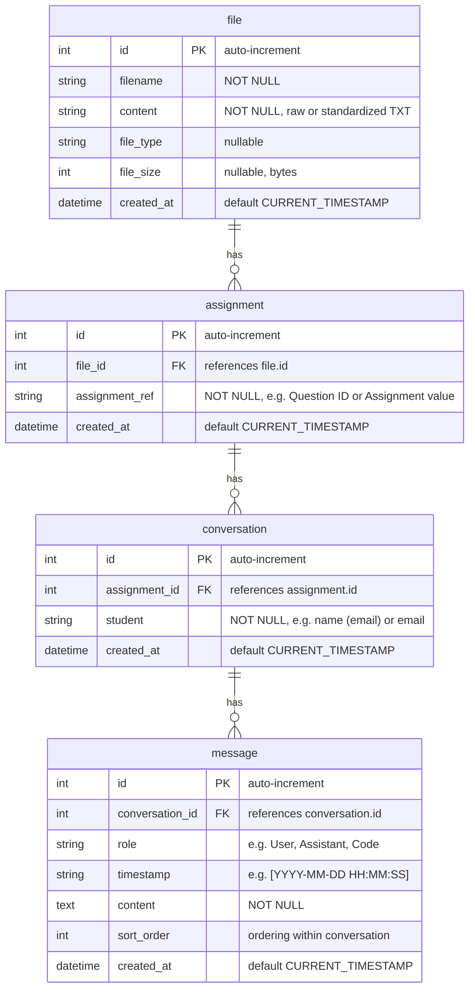

# ERD: Messages schema

Entity-relationship diagram for the database that houses messages, following:

**file** ‖–o{ **assignment** ‖–o{ **conversation** ‖–o{ **message**

(One file has zero or more assignments; one assignment has zero or more conversations; one conversation has zero or more messages.)

---

## Diagram



---

## Cardinality

| Parent   | Child        | Cardinality | Description                                      |
|----------|--------------|-------------|--------------------------------------------------|
| file     | assignment   | 1 : 0..*    | One file has zero or more assignments.           |
| assignment | conversation | 1 : 0..*  | One assignment has zero or more conversations.   |
| conversation | message   | 1 : 0..*    | One conversation has zero or more messages.      |

---

## Notes

- **file**: Uploaded TXT (raw or standardized). Same as current `files` table; can be reused or normalized into this hierarchy.
- **assignment**: Unique assignment identifier within a file (e.g. `Question ID: 1`, `Assignment: HW1`). Extracted from standardized TXT.
- **conversation**: One student’s thread for one assignment (`Student` + `Assignment`). Multiple conversations per assignment (different students).
- **message**: A single message in a conversation (`----Role [timestamp]` or `----Code:` plus content). `sort_order` preserves display order.

---

## Suggested DDL

```sql
-- file: corresponds to existing `files` table; use `file` here to match ERD entity.
CREATE TABLE IF NOT EXISTS files (
    id INTEGER PRIMARY KEY AUTOINCREMENT,
    filename TEXT NOT NULL,
    content TEXT NOT NULL,
    file_type TEXT,
    file_size INTEGER,
    created_at DATETIME DEFAULT CURRENT_TIMESTAMP
);

CREATE TABLE IF NOT EXISTS assignment (
    id INTEGER PRIMARY KEY AUTOINCREMENT,
    file_id INTEGER NOT NULL REFERENCES file(id) ON DELETE CASCADE,
    assignment_ref TEXT NOT NULL,
    created_at DATETIME DEFAULT CURRENT_TIMESTAMP
);

CREATE TABLE IF NOT EXISTS conversation (
    id INTEGER PRIMARY KEY AUTOINCREMENT,
    assignment_id INTEGER NOT NULL REFERENCES assignment(id) ON DELETE CASCADE,
    student TEXT NOT NULL,
    created_at DATETIME DEFAULT CURRENT_TIMESTAMP
);

CREATE TABLE IF NOT EXISTS message (
    id INTEGER PRIMARY KEY AUTOINCREMENT,
    conversation_id INTEGER NOT NULL REFERENCES conversation(id) ON DELETE CASCADE,
    role TEXT,
    timestamp TEXT,
    content TEXT NOT NULL,
    sort_order INTEGER NOT NULL DEFAULT 0,
    created_at DATETIME DEFAULT CURRENT_TIMESTAMP
);

CREATE INDEX IF NOT EXISTS idx_assignment_file_id ON assignment(file_id);
CREATE INDEX IF NOT EXISTS idx_conversation_assignment_id ON conversation(assignment_id);
CREATE INDEX IF NOT EXISTS idx_message_conversation_id ON message(conversation_id);
CREATE INDEX IF NOT EXISTS idx_message_sort ON message(conversation_id, sort_order);
```
